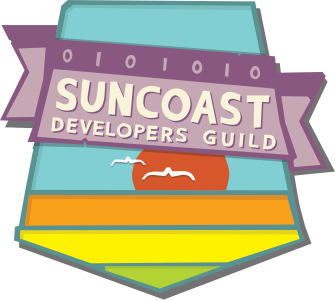
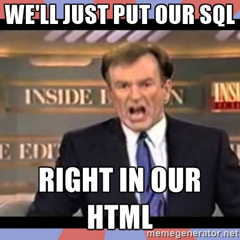

autoscale: true

# [fit] *Crash Course*

# [fit] Ruby on Rails


---

# [fit] Gavin Stark

## [fit] Back End Ruby Instructor

## [fit] Co Organizer of The Tampa Ruby Brigade

---

# [fit] Riley


---

# [fit] Tampa Ruby Brigade

## [fit] 10 Years Old

-

## meetup.com/tamparb


---

# [fit] Suncoast <br> Developers <br> Guild

-
-
-
-

## suncoast.io



^ A collective of software engineers and programmers in the Tampa Bay Area.

^ Our purpose is to promote a sense of community among local technology organizations and their members

---


---

# About the Web

- HTML pages delivered to your browser
- Delivered via HTTP/TLS protocol
- JavaScript/CSS/image and other assets
- Cookies
- Links followed and forms submitted
- Recently: websockets

---

# HTTP protocol

- Basis for everything we do on the web
- *(H)yper(t)ext (T)ransport (P)rotocol*
- Tim Berners-Lee at CERN in 1989
- _(now Sir Tim Berners-Lee)_
- Yes, you can be knighted for inventing a protocol

---


---

# Who uses Rails anyway?

- The Iron Yard
- 500px
- Airbnb
- Dribble
- Funny or Die
- Genius (Rap Genius)
- GitHub

---

# Who uses Rails anyway?

- Goodreads
- Groupon
- LivingSocial
- Hulu
- Kickstarter
- Shopify
- Square
- Urban Dictionary

---

# Brief history of Rails

- _David Heinemeier Hansson_ contracted to build Basecamp
- Convinced 37 Signals to allow him to code it in `Ruby`
- **Extracted** from that code base

---


---

# Opinionated Software

- Convention over Configuration
- Don't Repeat Yourself
- Testing built-in
- Environments built in (dev, test, prod)
- Database migrations

---

# Application patterns

- Everything in a familiar place
- ActiveRecord
- Extends Ruby
- DSL

---

-
-
-

## Dynamic Data on the Web



---

# Dynamic Data on the Web

```xml
<cfoutput>
  <cfquery name="myQuery" datasource="#myDatabase#">
    SELECT name, balance FROM accounts where status = 'active'
  </cfquery>
  <cfloop query="myQuery">
    #name# - #balance# <br/>
  </cfloop>
</cfoutput>
```

---

# ActiveRecord

- Based on the “Active Record” pattern
- Defines objects around database records
- Defines query interfaces
- Defines relationships between objects (tables)

---

# ActiveRecord

- Typically to map table to object
- Determines attributes by reflection
- Base class exposes creating, find, update, delete API

---

# ActiveRecord

```ruby
class Account < ActiveRecord::Base
  has_many :transfers
  belongs_to :customer

  scope :active -> { where(status: "active") }

  def available_to_withdraw
    balance - pending
  end
end
```

---

# Database Migrations


---


---

```ruby
class CreateBooks < ActiveRecord::Migration
  def change
    create_table :books do |t|
      t.string :title
      t.string :author_name
      t.datetime :date_published

      t.timestamps null: false
    end
  end
end
```

---

# Testing

- Built into framework, generates test files for generated models, controllers.
- Can generate tests for:
  - Models
  - Controllers
  - Integration
  - e-mail

---

# [fit] Let's make an app

---

# But first...

- Installing Rails isn't as easy as it should be
- especially on Windows … _(Rails Installer)_
- Others:
  - ruby-install
  - rvm
  - homebrew (mac)
  - third party repo with an up-to-date ruby (2.2 or later)
- Fortunately, we can use a cloud based environment for this course

---

# Cloud 9

- Login to `c9.io`
- Register for free account
  - Credit card required: 😠
- Click: *Create a new workspace*

---

# Cloud 9

- Enter a workspace name (`foodtruck`)
- Choose Hosted
- Choose Public
- Enter this as the URL:
  - `https://github.com/tiy-tpa-ruby/food-truck.git`
- Select *Ruby* as the template
- Click 'Create workspace'

---

# [fit] Lets code!!

---
